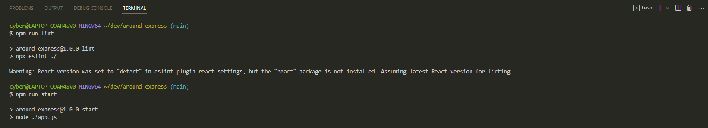
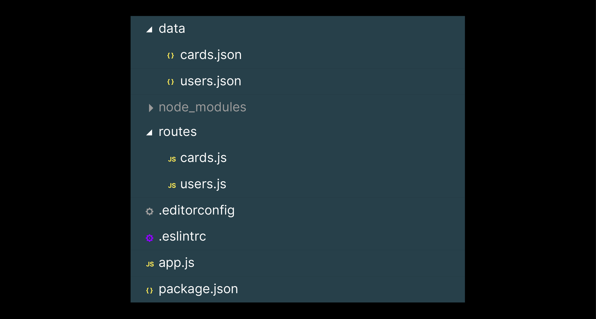

# 
 Around the U.S. API 

## This is the back-end API for the Around the U.S. project. It provides server functionality for user authentication, database management, and more.

## **Installation**

## To install this API, follow these steps:

1. Clone the repository to your local machine using `git clone <repository-url>`

## Running the Project

2. Install the dependencies by running `npm install`
3. Start the server using `npm run dev`
4. To launch the server with the hot reload feature `npm run dev`

## Directories

`/data` — JSON files to temporarily emulate database integration.

`/routes` — routing files.

All other directories are optional and may be created by the developer if necessary.

## **The initial project structure should look something like this:**

